# TA Recruitment System — User Manual

**EBU6304 Software Engineering Group Project | Group 101**  
**Version 4.0 | May 2026**

---

## Table of Contents

1. [System Setup](#1-system-setup)
2. [Login & Registration](#2-login--registration)
3. [Teaching Assistant (TA) Portal](#3-teaching-assistant-ta-portal)
4. [Module Organiser (MO) Portal](#4-module-organiser-mo-portal)
5. [Administrator Portal](#5-administrator-portal)
6. [Notification System](#6-notification-system)
7. [Error Handling](#7-error-handling)

---

## 1. System Setup

### Prerequisites
- Java 11 or higher
- Apache Maven 3.6 or higher

### How to Run
```bash
cd ta-recruitment
mvn clean tomcat7:run
```
Open your browser and navigate to: **http://localhost:8080/**

### Test Accounts

| Username | Password | Role |
|----------|----------|------|
| admin | admin | Administrator |
| prof_wang | password | Module Organiser |
| student_li | password | Teaching Assistant |
| student_zhang | password | Teaching Assistant |

---

## 2. Login & Registration

### 2.1 Login Page

The login page is the entry point of the system. Users enter their username and password to access their role-specific portal.

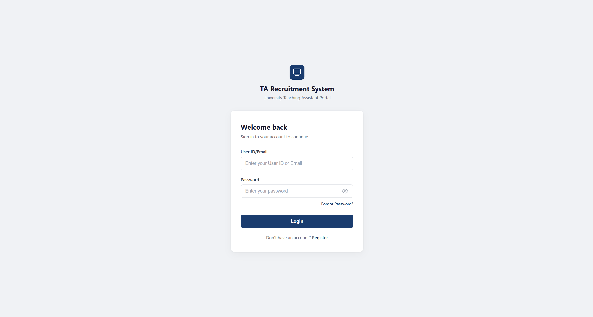

**Features:**
- Username and password input fields
- "Forgot Password?" link for password recovery
- "Register" link for new user registration
- Password visibility toggle (eye icon)
- After 5 consecutive failed login attempts, the account is locked for 5 minutes

### 2.2 Registration Page

New users can register by providing a username, email, password, role selection, and a security question for password recovery.

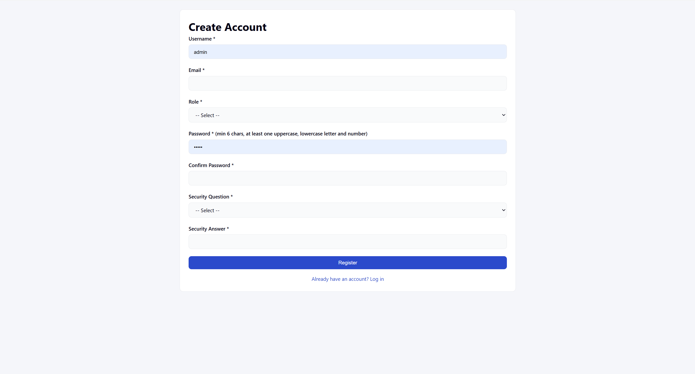

**Fields:**
- Username (required)
- Email (required, must be valid format)
- Password (required, minimum 6 characters, must contain uppercase, lowercase, and digit)
- Confirm Password
- Role: TA (Student) or MO (Module Organiser)
- Security Question and Answer (for password recovery)

### 2.3 Password Recovery

Users who forget their password can recover it by verifying their username and security answer.

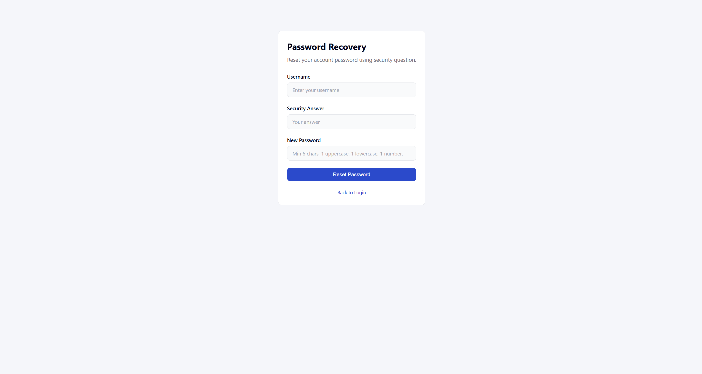

---

## 3. Teaching Assistant (TA) Portal

After logging in as a TA, users see a sidebar navigation with: Home, Profile, Jobs, and Applications.

### 3.1 TA Dashboard (Home)

The dashboard provides quick navigation to the main TA features.

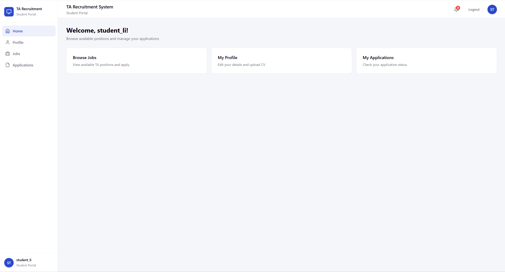

### 3.2 Profile Management

TAs can create and edit their personal profile, and upload their CV.

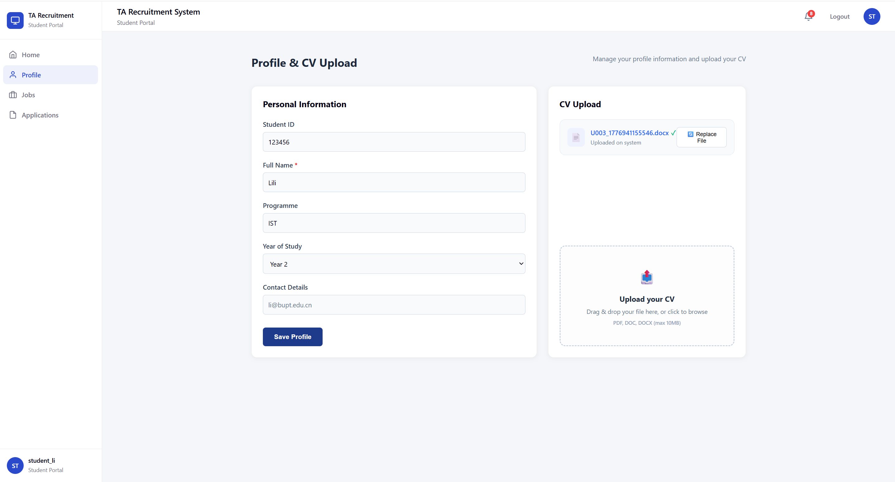

**How to use:**
1. Fill in Student ID, Full Name, Programme, Year of Study, and Phone Number
2. Click **Save Profile**
3. To upload a CV, click **Choose File**, select a PDF or DOCX file (max 10MB), then click **Upload CV**
4. After uploading, a "View uploaded file" link appears to preview the CV

### 3.3 Browse Available Jobs

TAs can browse all open TA positions posted by Module Organisers.

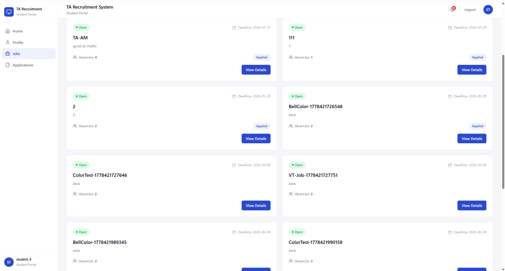

**Each job card displays:**
- Job status badge (Open)
- Application deadline
- Module name and description
- Requirements
- Number of vacancies
- "View Details" button to apply
- "Applied" badge if already applied

### 3.4 Apply for a Job

Clicking "View Details" on a job shows the job detail page where TAs can submit their application.

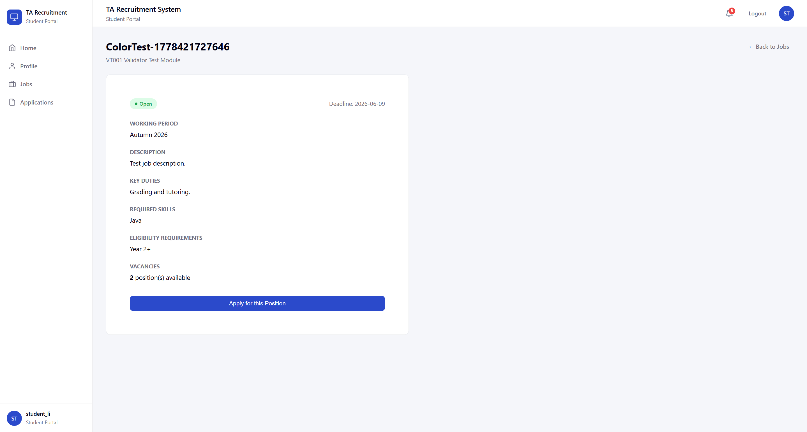

**Rules:**
- TA must have a completed profile before applying
- Duplicate applications for the same job are prevented
- After applying, the application status is set to "SUBMITTED"

### 3.5 My Applications

TAs can track the status of all their submitted applications.

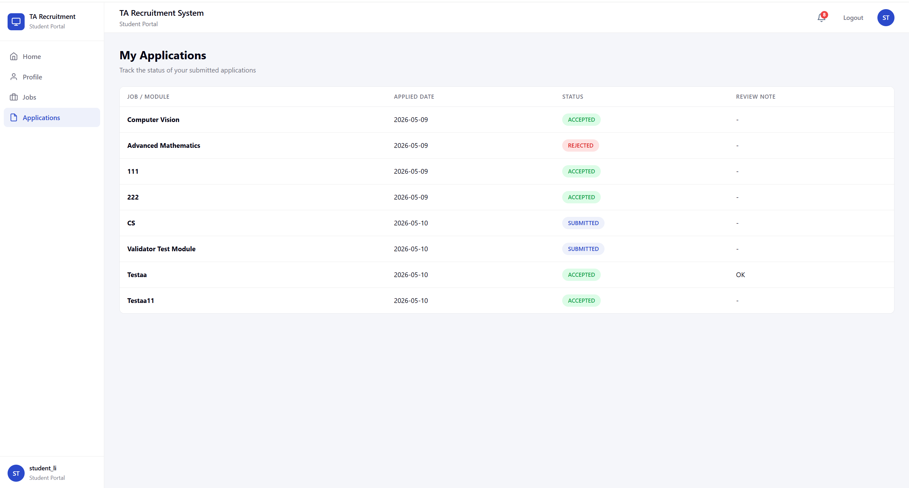

**Status flow:** SUBMITTED → UNDER_REVIEW → ACCEPTED / REJECTED

---

## 4. Module Organiser (MO) Portal

After logging in as MO, users see: Dashboard, Job Postings, Applicants & Review, and Recruitment Progress.

### 4.1 MO Dashboard

The dashboard provides quick access to MO features.

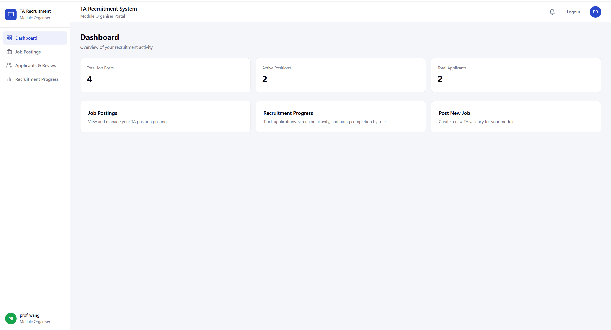

### 4.2 Job Postings

MOs can view, create, edit, and close their TA job postings.

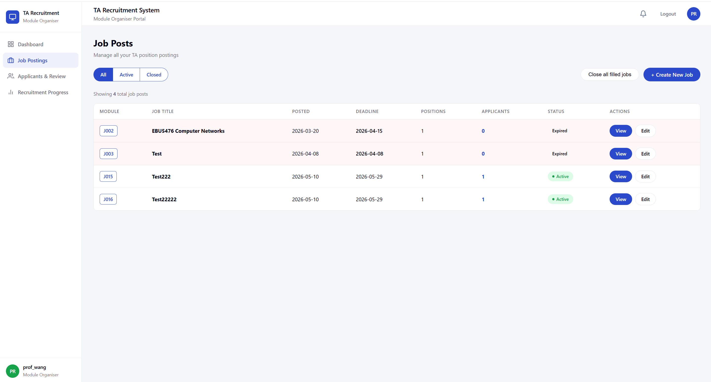

**Features:**
- **All / Active / Closed** filter tabs
- **+ Create New Job** button
- Each job row shows: Module, Job Title, Posted date, Deadline, Positions, Applicants count, Status, View/Edit/Close buttons
- **Close all filled jobs** button to batch-close positions where all vacancies are filled

### 4.3 Create New Job

MOs can post a new TA position by filling in the job details form.

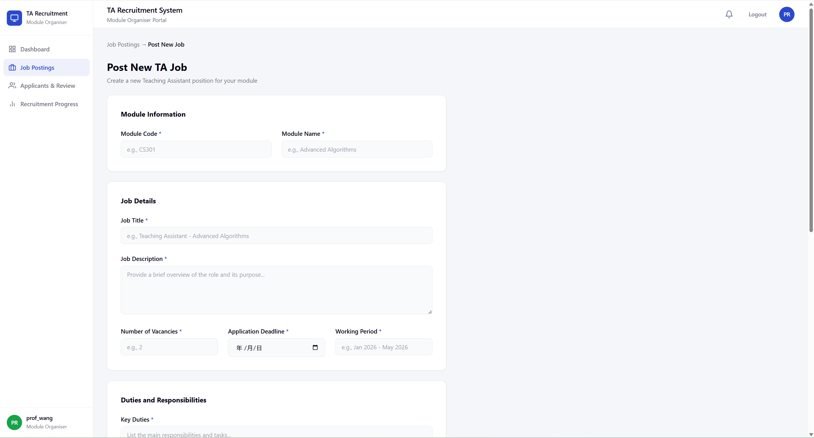

**Fields:**
- Module Code, Module Name, Job Title
- Description, Key Duties, Required Skills, Eligibility
- Number of Vacancies, Application Deadline, Working Period

### 4.4 Applicants & Review

MOs can review all applicants for their job postings, view CVs, and update application status.

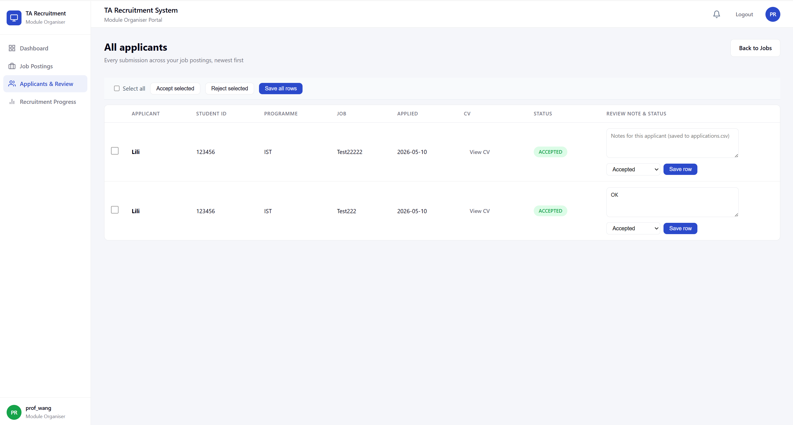

**How to use:**
1. Click **Applicants & Review** in the sidebar, or click **View** on a specific job
2. View applicant details: name, student ID, programme, CV
3. Click **View CV** to open the applicant's uploaded CV
4. Change status using the dropdown (Submitted / Under Review / Accepted / Rejected)
5. Click **Save** to update

### 4.5 Recruitment Progress

MOs can track the overall progress of their recruitment activities.

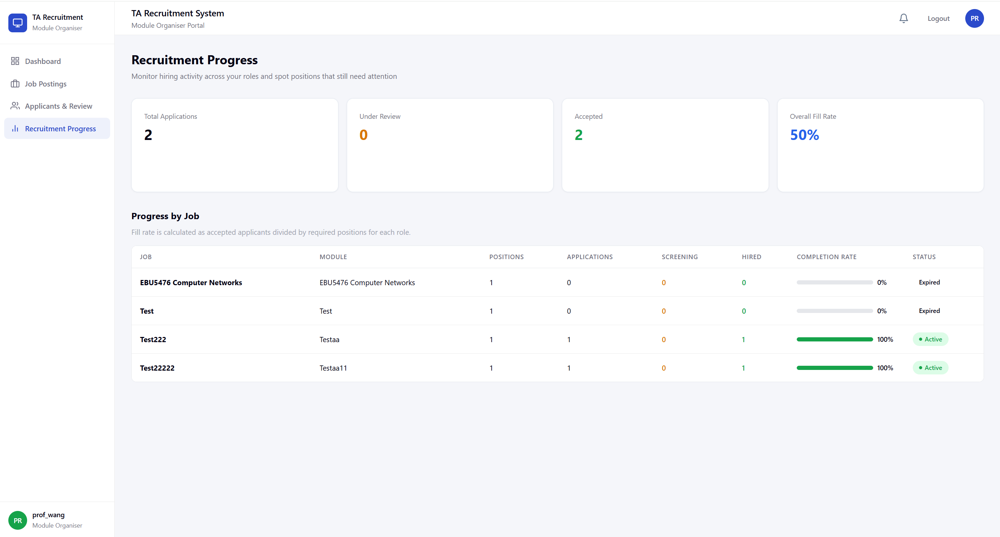

**Displays:**
- Summary cards: Total Applications, Accepted, Under Review, Submitted, Rejected
- Progress by Job table with: positions, applicants, accepted count, fill rate percentage, status (Active/Expired)

---

## 5. Administrator Portal

After logging in as Admin, users see: Dashboard, Account Management, AI Workload, and Settings.

### 5.1 Admin Dashboard

The dashboard provides a global overview of the system.

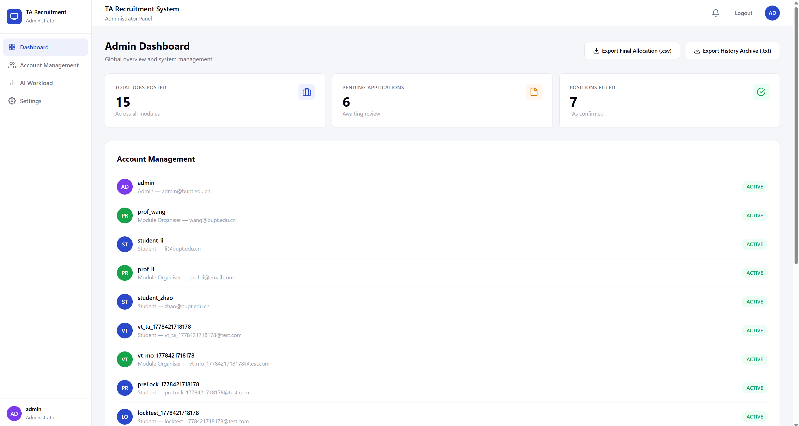

**Features:**
- Three statistics cards with real-time data
- **Export Final Allocation (.csv)** — download a CSV report of all accepted TA-job assignments
- **Export History Archive (.txt)** — download a complete application history
- Account Management section with Suspend/Reactivate/Delete actions
- TA Workload Monitoring table with overloaded TAs highlighted in red

### 5.2 Account Management

Admins can manage all user accounts in the system.

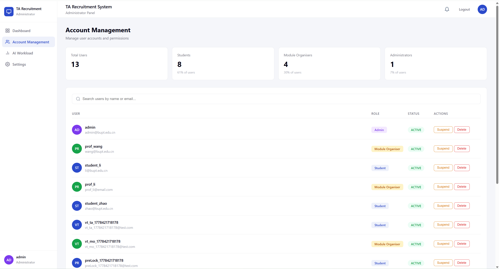

**Features:**
- Statistics cards: Total Users, Students, Module Organisers, Administrators
- Search bar to filter users by name or email
- User list with avatar, role badge, status badge
- Actions: Suspend, Reactivate, Delete

### 5.3 AI Workload Balancing

The AI workload page provides intelligent recommendations for redistributing TA workload.

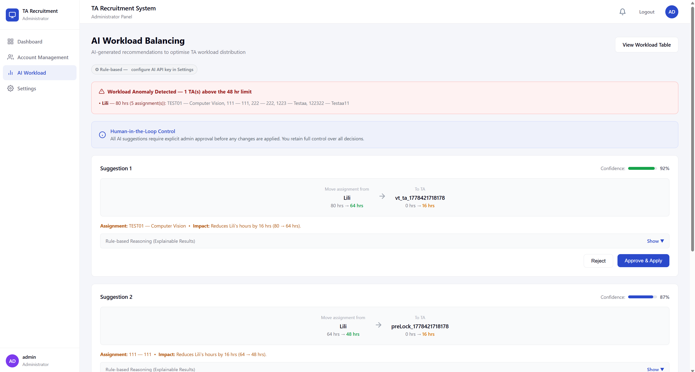

**Features:**
- **Human-in-the-Loop Control** banner — all suggestions require admin approval
- Overload detection alert showing which TAs exceed the 48-hour threshold
- AI-generated suggestion cards with:
  - Confidence score and progress bar
  - Transfer visualization (from TA → to TA)
  - Impact description
  - Expandable "Rule-based Reasoning (Explainable Results)" section
  - Approve & Apply / Reject buttons
- **View Workload Table** link to see detailed workload data

### 5.4 TA Workload Table

Detailed view of all TA workloads.

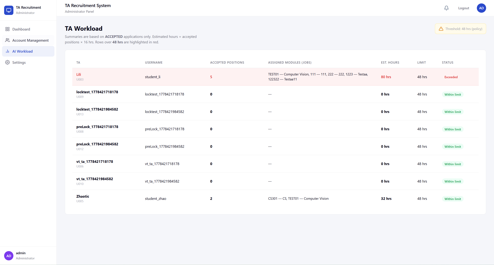

**Features:**
- Statistics cards: Total TAs, Normal Workload, Overloaded, Hour Limit
- Threshold explanation box
- Table with: TA Name, Student ID, Assigned Modules, Assignments count, Total Working Hours, Limit, Status
- Overloaded TAs (>48 hours) highlighted with red background and "⚠ Exceeded" badge

### 5.5 Settings

System configuration page for administrators.

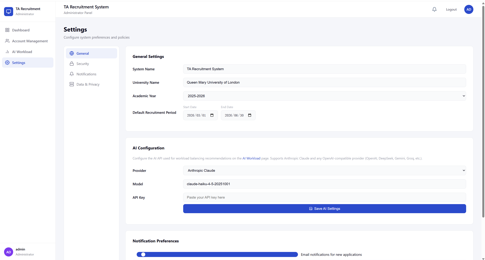

**Tabs:**
- **General** — System Name, University Name, Academic Year, Default Recruitment Period
- **Security** — Security-related configurations
- **Notifications** — Toggle email notifications, weekly reports, AI workload alerts
- **Data & Privacy** — Data management options

---

## 6. Notification System

All three roles have a notification bell icon in the top-right corner of the page.

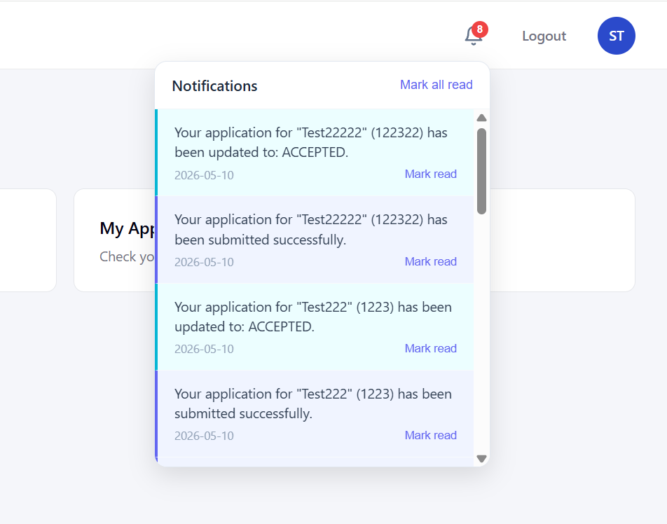

**How it works:**
- A red badge with a number appears when there are unread notifications
- Click the bell to open the notification panel
- Each notification shows the message and date
- Click **Mark read** on individual notifications, or **Mark all read** to clear all
- After marking as read, the red badge disappears

**Notification triggers:**
- **TA applies for a job** → MO receives a notification
- **MO changes application status** → TA receives a notification
- **TA workload exceeds threshold** → Admin receives an alert notification

---

## 7. Error Handling

### 7.1 Access Control (403 Forbidden)

Users attempting to access pages outside their role permissions will see a 403 error page.

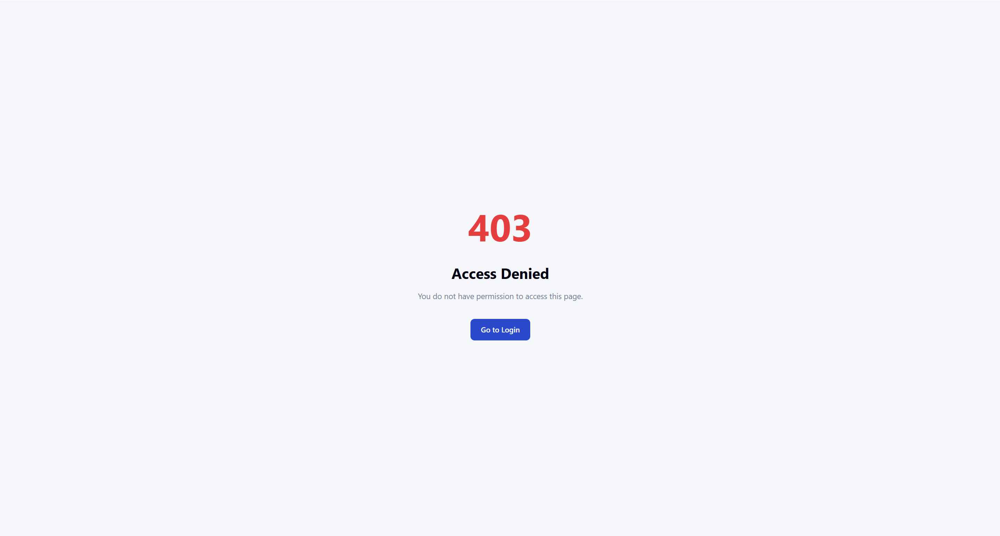

### 7.2 Form Validation

All forms include both client-side and server-side validation:
- Empty required fields show error messages
- Invalid email format is rejected
- Passwords must meet strength requirements (min 6 chars, uppercase, lowercase, digit)
- CV upload only accepts PDF/DOCX files (max 10MB)
- Duplicate job applications are prevented

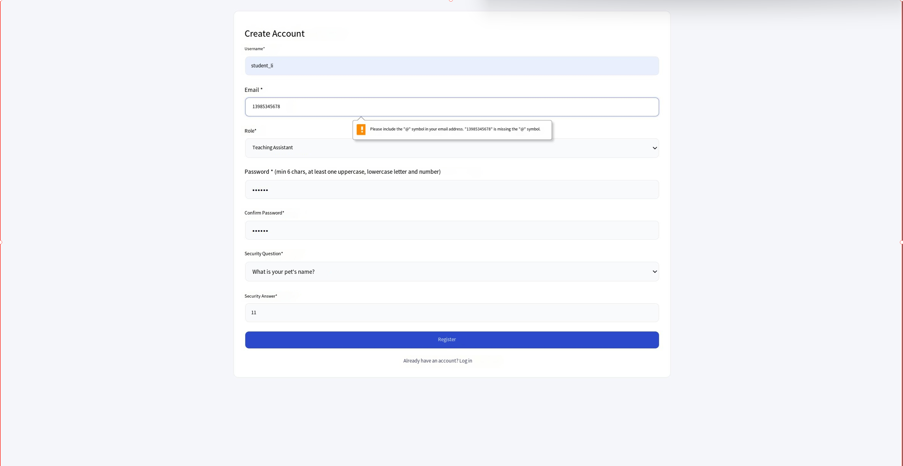

### 7.3 Login Lockout

After 5 consecutive failed login attempts, the account is locked for 5 minutes.

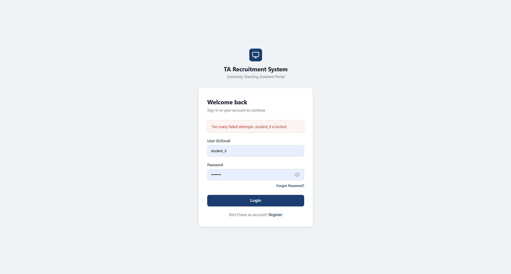

---

## Appendix: System Architecture

```
ta-recruitment/
├── src/main/java/com/ta/
│   ├── model/      User, Job, Application, TAProfile, Notification
│   ├── dao/        UserDAO, JobDAO, ApplicationDAO, TAProfileDAO, NotificationDAO
│   ├── servlet/    All HTTP request handlers (Login, Register, Apply, PostJob, etc.)
│   └── util/       FileManager, PasswordUtil, SessionUtil, Validator
├── src/main/webapp/
│   ├── css/        Stylesheets
│   ├── ta/         TA portal pages (dashboard, jobs, profile, applications)
│   ├── mo/         MO portal pages (dashboard, jobs, post-job, applicants, progress)
│   ├── admin/      Admin portal pages (dashboard, users, ai-workload, workload, settings)
│   ├── data/       CSV data files
│   └── uploads/    Uploaded CV files
└── src/test/java/  Test programs
```

**Technology Stack:** Java 11, Servlet 4.0, JSP, Maven, Embedded Tomcat 7, CSV file storage, SHA-256 password hashing
